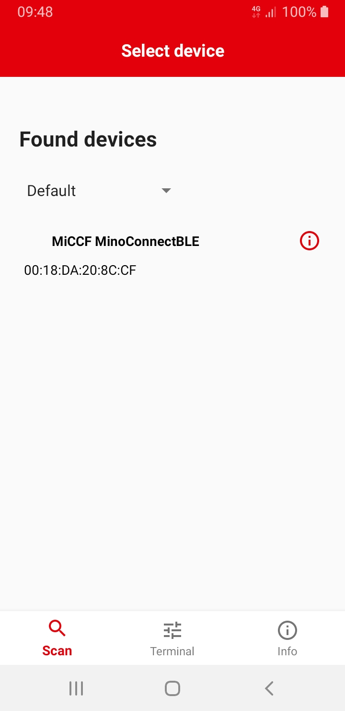
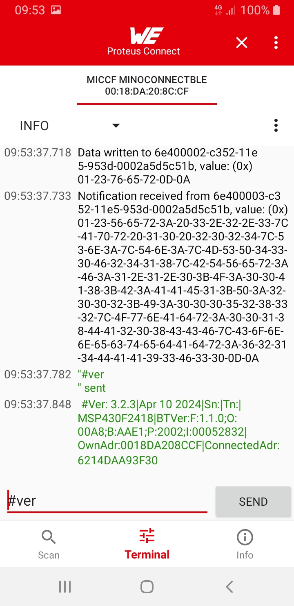

# Demo for the integration of MinoConnect V3

## General information

This app is based on Proteus-Connect-Android from Würth Elektronik eiSos with a few small adjustments to give you an overview of how you can integrate MinoConnect V3 (https://zenner.de/products/sys_minoconnect_radio/).

## Installation and use

1. Load the code into Android Studio and select the "app" project.
2. Pair MinoConnect Bluetooth LE (version >= 3.2.1) with the Android phone.
3. Run the project on your Android phone and accept the license terms.
4. You will then see the paired MinoConnect device in the main dialog.
5. Click on the desired MinoConnect to open the terminal dialog.
6. In the terminal, you can see how the app connects to the MinoConnect.
7. Now press the "Send" button and ASCII commando #ver is sent to MinoConnect.
8. This MinoConnect responds with a version string.
9. Done.

Scan screen                                           | Terminal screen                                           
:---------------------------------------------------: | :-------------------------------------------------------: 
  | 
